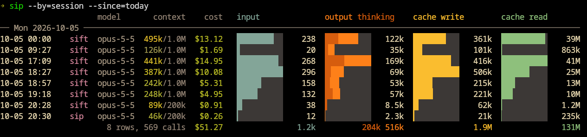

# sip

Visualize [Claude Code](https://claude.com/claude-code) token usage from your local session transcripts.

`sip` reads the JSONL transcripts under `~/.claude/projects`, deduplicates API calls, and
renders token usage as ANSI bar charts in the terminal, or as a PNG via gnuplot.



## Features

- group usage per day, week, session or project
- input, output, cache write and cache read tokens; output bars split out extended thinking
- peak context window utilization per row
- estimated cost based on Anthropic API list prices
- filter by date range, project directory or model
- gnuplot renderer, displayed inline in kitty

## Install

```zsh
cargo install --path .
```

The gnuplot renderer requires `gnuplot` on your `PATH`.

## Usage

```zsh
# daily usage, 30 most recent rows (default)
sip

# per session this week, subagents as separate rows
sip --by session --since week --split-subagents

# opus only, output and cache reads, for a single project
sip --model opus --category out,cr --project sip

# weekly usage as a PNG
sip --by week --render gnuplot --output usage.png
```

`--since` and `--until` accept a date (`2026-09-01`), `today`, `week`, `month` or a relative
span (`12h`, `7d`, `2w`).

Transcripts are read from `$CLAUDE_CONFIG_DIR/projects` or `~/.claude/projects`; override with
`--dir`. See `sip --help` for all options.

### Shell completions

```zsh
source <(sip --completions zsh)
```

## License

[MIT](LICENSE)
