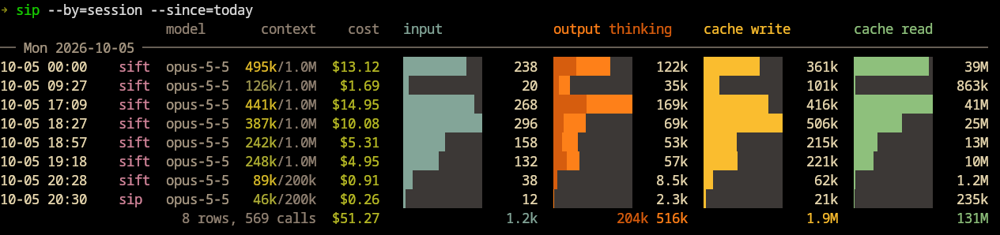

# sip

Visualize [Claude Code](https://claude.com/claude-code) token usage from your local session transcripts.

`sip` reads the JSONL transcripts under `~/.claude/projects`, deduplicates API calls, and
renders token usage as ANSI bar charts in the terminal, or as a PNG via gnuplot.



## Features

- group usage per day, week, session or project
- input, output, cache write and cache read tokens; output bars split out extended thinking
- peak context window utilization per row
- estimated cost based on Anthropic API list prices
- calendar view of the months in range, each day shaded by its cost or its tokens of one category
- filter by date range, project directory or model
- gnuplot renderer, displayed inline in kitty

## Install

```zsh
cargo install --path .
```

The gnuplot renderer requires `gnuplot` on your `PATH`.

## Usage

```zsh
# daily usage, 30 most recent rows (default)
sip

# per session this week
sip --by session --since week

# opus only, output and cache reads, for a single project
sip --model opus --category out,cr --project sip

# calendar of this year; days shaded by cost, or by output tokens with -c out
sip --cal --since 2026-01-01

# weekly usage as a PNG
sip --by week --render gnuplot --output usage.png
```

`--since` and `--until` accept a date (`2026-09-01`), `today`, `week`, `month`, a day of the
week (`mon`..`sun`, the most recent one) or a relative span (`12h`, `7d`, `2w`).

Transcripts are read from `$CLAUDE_CONFIG_DIR/projects` or `~/.claude/projects`; override with
`--dir`. See `sip --help` for all options.

### Keeping transcripts

Claude Code deletes session transcripts that have been inactive for more than 30 days, so by
default `sip` can only see about a month of history. Raise the limit with `cleanupPeriodDays`
in `~/.claude/settings.json` (or `$CLAUDE_CONFIG_DIR/settings.json`):

```json
{
  "cleanupPeriodDays": 36500
}
```

Don't set it to `0`: that does not mean "keep forever".

To keep a copy independent of Claude Code's settings, mirror the transcripts into an archive
and point `sip` at it. Leave out `--delete`, so that sessions Claude Code has cleaned up stay
in the archive:

```zsh
# e.g. from a daily cron job or systemd timer
rsync -a ~/.claude/projects/ ~/claude-archive/projects/

sip --dir ~/claude-archive/projects
```

Point `--dir` at one copy of each transcript only: API calls are deduplicated within a
transcript file, not across files, so a session present in two places is counted twice.

### Shell completions

```zsh
source <(sip --completions zsh)
```

## License

[MIT](LICENSE)
